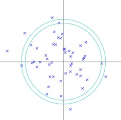

You may have heard, things in high dimensions dont always make sense, in fact some call it a [curse](https://en.wikipedia.org/wiki/Curse_of_dimensionality). One interesting phenomena is that the mass of a multivariate gaussian distribution becomes clustered on the edge, instead of the mean. In other words, "most of the volume of a high-dimensional orange is in the skin, not the pulp." [1]

This post aims to explain why that is, as well as estimating the probability of finding a point as a function of the distance from the mean.

## The Skin?

Imagine a 10x10 square. If we look at the center square that is 90% the size of the original, that is, 9x9, we have an area of 81. The outside square is 19. Now we consider a 3D cube that is 10x10x10. The inside square becomes 9x9x9, which has a volume of 729, and a remainder volume of 271. 

So far so good. Now what happens if we increase the number of dimensions to 5? The inside volume becomes $9^5 = 59049$ and the remaining volume is $10^5 - 9^5 = 40961$ We see that the outside volume almost surpasses the inside... Now try with $d=10, 20$ and so forth. Eventually what we see is this:


The mass increasingly becomes centered at a shell of the gaussian

## An Estimation 

Essentially, the probability of finding a point X at a certain distance r from the mean is this:

$$ P(X \approx r)=\frac{d r^{d-1} \pi^{\frac{d}{2}}}{\Gamma\left(\frac{d}{2}+1\right)} \frac{1}{2 \pi^{\frac{d}{2}} \sqrt{\sigma}} \exp \left(-\frac{1}{2 \sigma}\|\boldsymbol{x}-\boldsymbol{\mu}\|\right)$$

### Proof

A multivariate Gaussian distribution on d-dimensional space has probability density function (pdf)
$$
\rho(\boldsymbol{x})=\frac{1}{(2 \pi)^{\frac{d}{2}} \sqrt{|\Sigma|}} \exp \left(-\frac{1}{2}(\boldsymbol{x}-\boldsymbol{\mu})^{T} \Sigma^{-1}(\boldsymbol{x}-\boldsymbol{\mu})\right)
$$
Assuming that the distribution is spherical, i.e. $\Sigma=\sigma I,$ then $|\Sigma|=\sigma,$ and $(\boldsymbol{x}-\boldsymbol{\mu})^{T} \Sigma^{-1}(\boldsymbol{x}-\boldsymbol{\mu})=$
$\frac{1}{\sigma}\|\boldsymbol{x}-\boldsymbol{\mu}\| \cdot$ So we can rewrite the pdf as
$$
\rho(\boldsymbol{x})=\frac{1}{2 \pi^{\frac{d}{2}} \sqrt{\sigma}} \exp \left(-\frac{1}{2 \sigma}\|\boldsymbol{x}-\boldsymbol{\mu}\|\right)
$$

To find the probability of finding a point $X$ at a certain distance $r$ from the mean, we consider the probability that $X$ lies in a small interval/subset $A$
$$
P(X \in A)=\int_{A} \rho(x) d x
$$
So if we wish to find the probability that $\mathrm{X}$ lies at a certain distance $r,$ we set the subset $A$ to be
over a circular region bound by the radius $r$ and $r+a,$ where $a$ is some arbitrary limit.
$$
\begin{aligned}
P(X \approx r) &=P\left(r<\sqrt{X_{1}^{2}+X_{2}^{2}+\cdots X_{d}^{2}}<r+a\right) \\
&=P\left(r<\sqrt{\sum_{1}^{d} X_{i}^{2}<r+a}\right) \mid \\
&=P\left(r<\|X\|_{2}<r+a\right) \\
&=\int \ldots \int_{V} \rho(\boldsymbol{x}) d x_{1} \ldots d x_{d}
\end{aligned}
$$
where $V$ is the region bound by two concentric n-spheres of radius $r$ and $r+a .$ If $a$ is small, then V becomes the surface area of the n-sphere.


The calculation of the above integral involves the erf(x) function, so instead we estimate that the resulting probability is found as the product of the gaussian pdf and the surface area of the n-sphere[^1]. i.e. 

$$\begin{aligned}
P(X \approx r) &=S A_{n-\text {sphere}} \times \rho(x) \\
&=\frac{d r^{d-1} \pi^{\frac{d}{2}}}{\Gamma\left(\frac{d}{2}+1\right)} \rho(r)
\end{aligned}$$

### Intuition II

To see why this is the case, we consider the 2D gaussian.  From the figure below, we see some points representative of the gaussian pdf.



To determine the probability of finding a point between the two circles, we calculate the integral

$$
P(X \approx r)=\iint_{S} \frac{1}{2 \pi} \mathrm{e}^{\left(-\frac{1}{2}\|x\|\right)} d x_{1} d x_{2}
$$
Now as the distance $a$ becomes small (i.e. the two circles become one), the integral collapses to the polf evaluated at all the points around the circle with radius $r$. i.e.
$$
P=2 \pi \times \frac{1}{2 \pi} \mathrm{e}^{\left(-\frac{1}{2}\|\mathbf{r}\|\right)}
$$

Which is the product of the pdf and the ‘surface area’ of a 2D sphere. Similarly for 3D, the probability distribution becomes the multivariate gaussian pdf evaluated on the surface of a sphere, which becomes the product of the pdf and the surface area. We generalize this to d-dimensions.

## Matlab Code
```Matlab
clear all, close all
figure, hold on
for d = [1,2, 20, 50]
    r = 0:0.2:10;
    Sigma = 1;    
    P =  (d*r.^(d-1)*pi^(d/2)/gamma(d/2+1))*1/(2*pi*Sigma).^(d/2).*exp(-r.^2/(2*Sigma));
    plot(P)
end 
legend('d=1', 'd=2', 'd=20', 'd=50')
title('Probability Density at different dimensions')
ylabel('Probability')
xlabel('radius')
```

# Empirical Estimation

If we simulate some points from a multivariate gaussian in MATLAB, we can empirically estimate the probability of finding a point as a certain function of distance. This is done by calculating the Euclidean distance of each point to the mean and then for each distance bin, we sum over the points that fall into this bin. Figure 1 is a 2D illustration of this: simply count the number of points that fall between the two circles. Intuitively, this works like an integration to determine the probability at each distance. The process/pseudo-code is as follows:
```
   1) Generate some multivariate gaussian samples 
   2) Calculate distances for each sample using distance formula
   sqrt(X1^2 + X2^2 + X3^2 + ...)
   3) count all the points that lie within two concentric circles given by some radius i.e. r<|(|X|)|_2<r+a
```
### Matlab 
```Matlab Code
ndim= [1 2 20 50];
rng('default')  % For reproducibility
r = 0:0.2:10;
npts = 200000;
figure, hold on
for d = ndim
    mu = zeros(1,d);
    sigma = eye(size(mu,2));
    R = mvnrnd(mu,sigma,npts);
    P = zeros(numel(r)-1, 1);

    % find all the distances for each 
    for j = 1:size(R,1)
        rr(j) = sqrt(sum(R(j,:).^2));
    end
    for i = 1:numel(r)-1
        %if that distance is within a small range <- count the number of pts that
        %fit this criterea. Trying to apply the pdf integration but for discrete
        P(i) = sum(r(i)<rr & rr<r(i+1));
    end
    plot(r(1:end-1),P./npts)
end
legend('d=1', 'd=2', 'd=20', 'd=50')
title('Probability Density at different dimensions')
ylabel('Probability')
xlabel('radius')
```


[^1]: The surface area of a n-sphere is found by differentiate the volume w.r.t. radius $r$. Volume can be found from google.

## Resources
- [1] [A Few Useful Things to Know about Machine Learning](https://homes.cs.washington.edu/~pedrod/papers/cacm12.pdf)
- https://stats.stackexchange.com/questions/419412/why-is-gaussian-distribution-on-high-dimensional-space-like-a-soap-bubble 